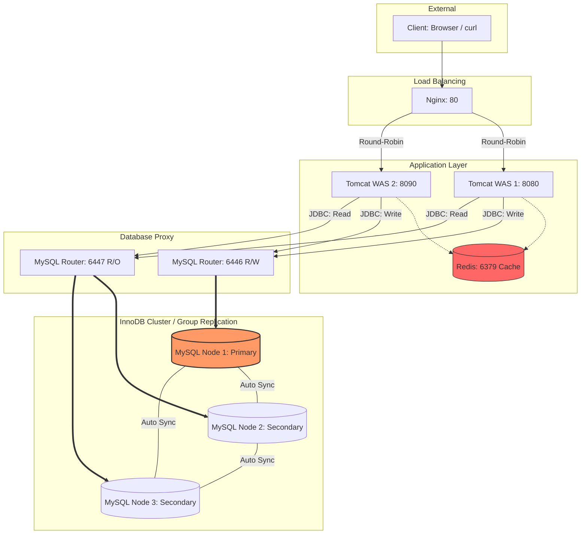

# 카드 소비 데이터 분석 서비스

라이프스테이지별 카드 소비 패턴을 분석하는 3-Tier 웹 애플리케이션입니다.


## 목차

1. [아키텍처 개요](#아키텍처-개요)
2. [기술 스택](#기술-스택)
3. [데이터](#데이터)
4. [API 엔드포인트](#api-엔드포인트)
5. [주요 설계 결정](#주요-설계-결정)
6. [시작 가이드](#시작-가이드)
7. [트러블슈팅](#트러블슈팅)

## 아키텍처 개요




### [시퀀스 다이어그램](./docs/sequence_diagram.md)


### 계층별 역할

| 계층         | 구성 요소        | 역할                                              |
| ------------ | ---------------- | ------------------------------------------------- |
| Presentation | Nginx            | HTTP 요청 수신, 두 대의 Tomcat으로 부하 분산      |
| Application  | Tomcat WAS × 2   | 비즈니스 로직 처리, DB 접근, 캐시 조회            |
| Cache        | Redis            | 반복 조회 결과 캐싱, DB 부하 절감                 |
| Data         | MySQL Node1      | Primary — 쓰기/읽기 처리                          |
| Data         | MySQL Node2, 3   | Secondary — 읽기 전용, Node1과 자동 동기화        |
| Proxy        | MySQL Router     | R/W 분리 프록시 (클러스터 구성 완료 후 별도 기동) |

### Source / Replica 분기 전략

```
읽기 요청 (SELECT)
  → LifeStageDao(REPLICA_DS)
      → MySQL Node2/3

쓰기 요청 (INSERT / DELETE)
  → LifeStageDao(SOURCE_DS)
      → MySQL Node1
```


### Redis Cache-Aside + Cache Stampede 방지

```
요청 → [1단계] Redis GET("life-stages:all")
              │
         ┌────┴────┐
         │ Hit?    │
         ├─ Yes ───► JSON 역직렬화 → 응답 (DB 미접근)
         └─ No ────► [2단계] 분산 락(SETNX) 획득 시도
                           │
                    ┌──────┴──────┐
                    │ 락 획득?    │
                    ├─ Yes ───────► DB 조회 → Redis SET(TTL=3600) → 락 해제 → 응답
                    └─ No ────────► 100ms 대기 후 Redis 재조회 (최대 50회)
                                              │
                                    캐시 없으면 → DB 직접 조회 (최후 수단)

Redis 장애 시: 각 단계의 예외를 독립적으로 catch → DB Fallback → 정상 응답
```

쓰기(INSERT/DELETE) 후 캐시 무효화:
```
AdminServlet.doPost() → DB 쓰기 → invalidateCache() → jedis.del("life-stages:all")
                                  └ Redis 장애 시 WARN 로그만 기록, DB 성공 응답은 그대로 반환
```

## 기술 스택

| 분류            | 기술                    | 버전            |
| --------------- | ----------------------- | --------------- |
| Language        | Java                    | 21              |
| WAS             | Apache Tomcat           | 9.0.115         |
| Web API         | Servlet / JSP           | Java EE 4.0     |
| Connection Pool | HikariCP                | 5.0.1           |
| JDBC Driver     | MySQL Connector/J       | 8.4.0           |
| Cache Client    | Jedis                   | 5.1.0           |
| JSON            | Gson                    | 2.10.1          |
| Logging         | SLF4J + Logback         | 2.0.16 / 1.5.15 |
| Boilerplate     | Lombok                  | 1.18.38         |
| Load Balancer   | Nginx                   | latest          |
| Cache           | Redis                   | 7.2-alpine      |
| Database        | MySQL InnoDB Cluster    | 8.4             |
| DB Proxy        | MySQL Router            | 8.4.0           |
| Container       | Docker / Docker Compose | -               |
| IDE             | Eclipse                 | -               |


## 데이터

- 테이블: `CARD_TRANSACTION`
- 규모: **약 538만 행** (5,382,734 rows)
- 주요 컬럼

| 컬럼             | 설명                                      |
| ---------------- | ----------------------------------------- |
| `LIFE_STAGE`     | 라이프스테이지 (분석 기준 주요 컬럼)      |
| `AGE`            | 연령대                                    |
| `SEX_CD`         | 성별                                      |
| `MBR_RK`         | 회원등급                                  |
| `TOT_USE_AM`     | 총 이용금액                               |
| `CRDSL_USE_AM`   | 신용카드 이용금액                         |
| `CNF_USE_AM`     | 체크카드 이용금액                         |
| 업종별 금액 컬럼 | INTERIOR_AM, INSUHOS_AM, TRVL_AM 외 다수 |

### 라이프스테이지 코드표

| 코드         | 설명           |
| ------------ | -------------- |
| `UNI`        | 대학생         |
| `NEW_JOB`    | 사회초년생     |
| `NEW_WED`    | 신혼부부       |
| `CHILD_BABY` | 영유아자녀     |
| `CHILD_TEEN` | 청소년자녀     |
| `CHILD_UNI`  | 대학생자녀     |
| `GOLLIFE`    | 중년           |
| `SECLIFE`    | 액티브시니어   |
| `RETIR`      | 은퇴           |


## API 엔드포인트

| 경로                                    | 메서드   | 설명                                | 인증 필요 | DataSource           |
| --------------------------------------- | -------- | ----------------------------------- | --------- | -------------------- |
| `/sample-project/login`                 | GET      | 로그인 페이지                       | 불필요    | -                    |
| `/sample-project/login`                 | POST     | 로그인 처리 → `/life-stages` 이동   | 불필요    | Source               |
| `/sample-project/logout`                | GET      | 세션 무효화 → `/login` 이동         | -         | -                    |
| `/sample-project/life-stages`           | GET      | 라이프스테이지별 소비 집계          | 필요      | Replica (Redis 캐시) |
| `/sample-project/info?type={lifeStage}` | GET      | 라이프스테이지 상세 분석 (4개 쿼리) | 필요      | Replica              |
| `/sample-project/admin/card-transaction`| GET      | Admin 페이지 (Insert/Delete 탭)     | 필요      | -                    |
| `/sample-project/admin/card-transaction`| POST     | 데이터 삽입 또는 삭제               | 필요      | Source               |
| `/sample-project/test/hikari`           | GET      | HikariCP 커넥션 헬스체크            | 불필요    | -                    |

## 주요 설계 결정

### HikariCP Source/Replica 분리

단일 DataSource 대신 두 개의 HikariCP 풀을 유지합니다.

```java
// ApplicationContextListener.java
sourceConfig.setDriverClassName("com.mysql.cj.jdbc.Driver");
sourceConfig.setJdbcUrl(props.getProperty("source.url"));   // Node1 :3307
replicaConfig.setDriverClassName("com.mysql.cj.jdbc.Driver");
replicaConfig.setJdbcUrl(props.getProperty("replica.url")); // Node2 :3308
```

- 읽기가 집중되는 서비스에서 Node2(Secondary)로 SELECT 부하를 분산
- Node1(Primary)은 쓰기 작업 전용으로 보호
- 두 풀 모두 `ServletContext`에 등록하여 서블릿에서 정적 메서드로 접근

### InnoDB Cluster (Group Replication)

MySQL Source-Replica 단방향 복제 대신 InnoDB Cluster를 구성합니다.

```
Node1 (Primary)  ←─ 자동 Failover ─→  Node2 / Node3 (Secondary)
     │                                         │
     └───────── Group Replication ─────────────┘
                 (동기적 데이터 전파)
```

- Primary에 커밋된 데이터는 `before_commit` 훅에서 전체 멤버에게 전파 후 응답
- Node1 장애 시 Node2 또는 Node3이 자동 승격(Failover)
- MySQL Router(`:6446` R/W, `:6447` R/O)로 애플리케이션 코드 변경 없이 R/W 분리 가능

### Redis Cache-Aside + 분산 락 (Cache Stampede 방지)

538만 행 집계 쿼리의 DB 부하를 최소화합니다.

- TTL 만료 순간 동시 요청이 몰려도 **단 1개의 요청만 DB 조회** (분산 락으로 보장)
- 락 값으로 UUID 사용 → 자신이 획득한 락만 해제 가능
- Redis 장애 시 GET/SET 블록 각각 독립 catch → DB Fallback → 정상 응답

### Redis 캐시 무효화 (Write-Around 패턴)

INSERT/DELETE 후 `jedis.del(CACHE_KEY)` 호출로 캐시를 무효화합니다.

```java
// AdminServlet.java
private void invalidateCache() {
    try (Jedis jedis = jedisPool.getResource()) {
        jedis.del(CACHE_KEY);
    } catch (Exception e) {
        log.warn("캐시 무효화 실패 (Redis 장애) - DB 데이터는 정상 처리됨: {}", e.getMessage());
    }
}
```

- 캐시 무효화 실패는 치명적이지 않음 — DB 쓰기 성공 응답은 그대로 반환
- 다음 GET 요청 시 TTL 만료 후 DB 재조회로 자연스럽게 캐시 재적재

### SQL 파일 외부화 (`loadSQL()`)

분석 쿼리를 Java 코드에 하드코딩하지 않고 `src/main/resources/sql/`에 별도 관리합니다.

```java
private String loadSQL(String filename) {
    InputStream is = getClass().getClassLoader().getResourceAsStream("sql/" + filename);
    if (is == null) {
        throw new RuntimeException("SQL 파일을 찾을 수 없습니다: sql/" + filename);
    }
    try (BufferedReader reader = new BufferedReader(new InputStreamReader(is, StandardCharsets.UTF_8))) {
        return reader.lines().collect(Collectors.joining("\n"));
    } catch (Exception e) {
        throw new RuntimeException("SQL 파일 로드 실패: " + filename, e);
    }
}
```

### 세션 기반 인증 (`AuthFilter`)

`/life-stages`, `/info`, `/admin/*` 경로를 `AuthFilter`로 보호합니다.

```java
@WebFilter({"/life-stages", "/info", "/admin/*"})
// 세션에 "loginUser" 속성이 없으면 /login으로 리다이렉트
```

- 로그아웃 시 서버 세션 무효화(`session.invalidate()`)와 함께 브라우저 JSESSIONID 쿠키 만료 처리
- `Cache-Control: no-store` 헤더로 로그아웃 후 브라우저 뒤로가기 방지

### InfoServlet 병렬 쿼리 실행

라이프스테이지 상세 분석 페이지는 4개의 쿼리를 전용 스레드 풀에서 병렬 실행합니다.

```java
private static final Executor DB_QUERY_POOL = Executors.newFixedThreadPool(10);

CompletableFuture.supplyAsync(() -> dao.findCreditOfCheckByLifeStage(code), DB_QUERY_POOL);
CompletableFuture.supplyAsync(() -> dao.findMembershipTierByLifeStage(code), DB_QUERY_POOL);
CompletableFuture.supplyAsync(() -> dao.findConsumptionTypeByLifeStage(code), DB_QUERY_POOL);
CompletableFuture.supplyAsync(() -> dao.findTop5ByLifeStage(code),            DB_QUERY_POOL);
```

- `ForkJoinPool.commonPool()` 대신 전용 풀 사용 → JVM 전역 공용 풀 고갈 방지
- 스레드 풀 크기(10)를 HikariCP 최대 커넥션 수와 맞춤


## [시작 가이드](docs/how_to_start.md)

## [트러블 슈팅](docs/troubleshooting.md)

