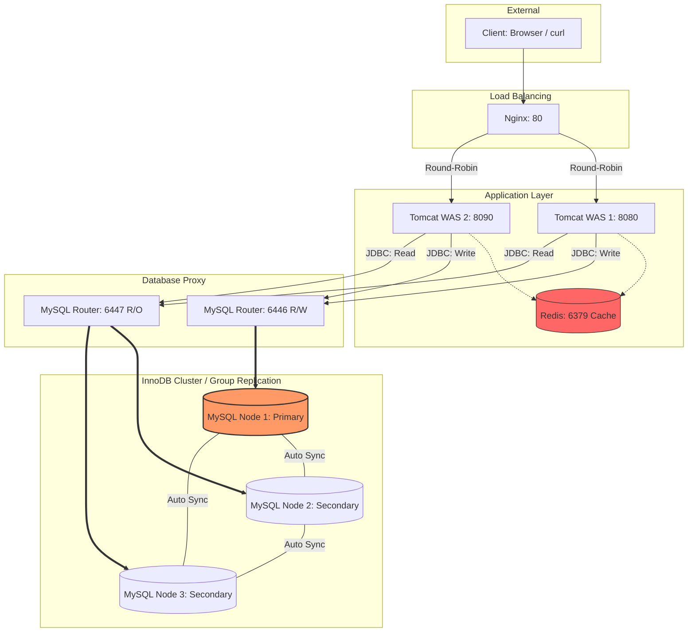
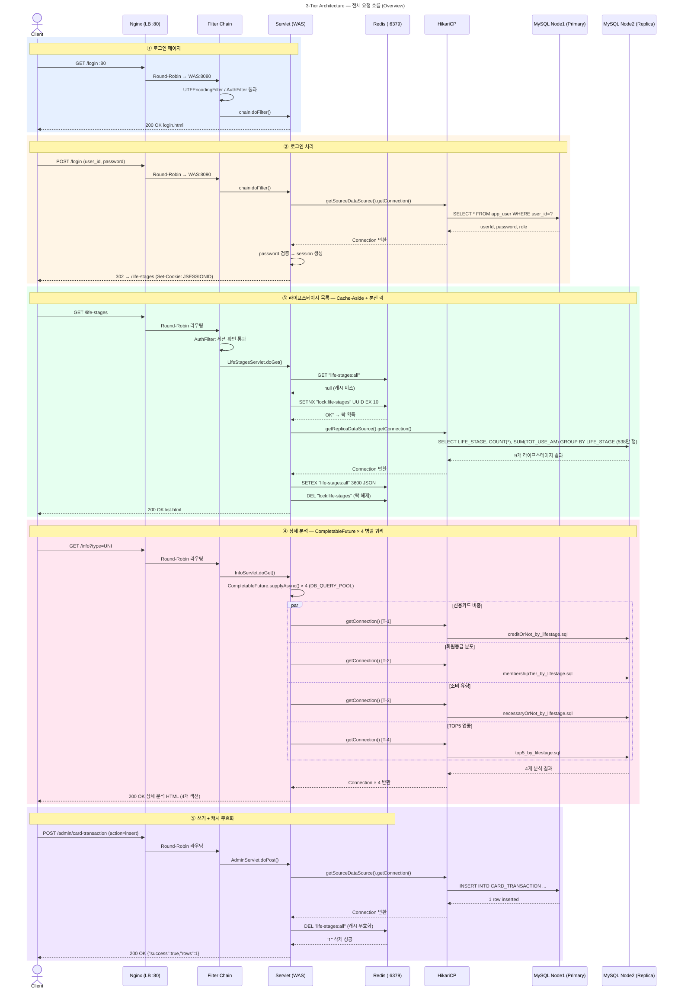

# 카드 소비 데이터 분석 서비스

라이프스테이지별 카드 소비 패턴을 분석하는 3-Tier 웹 애플리케이션입니다.


https://github.com/user-attachments/assets/d671a47e-7954-4691-b117-42c121bc56cf

https://github.com/user-attachments/assets/726a165d-9695-4858-bfa1-69710c3addf1


## 목차

1. [아키텍처 개요](#아키텍처-개요)
2. [기술 스택](#기술-스택)
3. [프로젝트 구조](#프로젝트-구조)
4. [데이터](#데이터)
5. [시작 가이드](#시작-가이드)
6. [API 엔드포인트](#api-엔드포인트)
7. [주요 설계 결정](#주요-설계-결정)
8. [트러블슈팅](#트러블슈팅)

## 아키텍처 개요




### 시퀀스 다이어그램



### 계층별 역할

| 계층         | 구성 요소        | 역할                                              |
| ------------ | ---------------- | ------------------------------------------------- |
| Presentation | Nginx            | HTTP 요청 수신, 두 대의 Tomcat으로 부하 분산      |
| Application  | Tomcat WAS × 2   | 비즈니스 로직 처리, DB 접근, 캐시 조회            |
| Cache        | Redis            | 반복 조회 결과 캐싱, DB 부하 절감                 |
| Data         | MySQL Node1      | Primary — 쓰기/읽기 처리                          |
| Data         | MySQL Node2, 3   | Secondary — 읽기 전용, Node1과 자동 동기화        |
| Proxy        | MySQL Router     | R/W 분리 프록시 (클러스터 구성 완료 후 별도 기동) |

### Source / Replica 분기 전략

```
읽기 요청 (SELECT)
  → LifeStageDao(REPLICA_DS)
      → MySQL Node2 :3308

쓰기 요청 (INSERT / DELETE)
  → LifeStageDao(SOURCE_DS)
      → MySQL Node1 :3307
```

- Source: `localhost:3307` → Node1 컨테이너 내부 `3306`
- Replica: `localhost:3308` → Node2 컨테이너 내부 `3306`

### Redis Cache-Aside + Cache Stampede 방지

```
요청 → [1단계] Redis GET("life-stages:all")
              │
         ┌────┴────┐
         │ Hit?    │
         ├─ Yes ───► JSON 역직렬화 → 응답 (DB 미접근)
         └─ No ────► [2단계] 분산 락(SETNX) 획득 시도
                           │
                    ┌──────┴──────┐
                    │ 락 획득?    │
                    ├─ Yes ───────► DB 조회 → Redis SET(TTL=3600) → 락 해제 → 응답
                    └─ No ────────► 100ms 대기 후 Redis 재조회 (최대 50회)
                                              │
                                    캐시 없으면 → DB 직접 조회 (최후 수단)

Redis 장애 시: 각 단계의 예외를 독립적으로 catch → DB Fallback → 정상 응답
```

쓰기(INSERT/DELETE) 후 캐시 무효화:
```
AdminServlet.doPost() → DB 쓰기 → invalidateCache() → jedis.del("life-stages:all")
                                  └ Redis 장애 시 WARN 로그만 기록, DB 성공 응답은 그대로 반환
```

## 기술 스택

| 분류            | 기술                    | 버전            |
| --------------- | ----------------------- | --------------- |
| Language        | Java                    | 21              |
| WAS             | Apache Tomcat           | 9.0.115         |
| Web API         | Servlet / JSP           | Java EE 4.0     |
| Connection Pool | HikariCP                | 5.0.1           |
| JDBC Driver     | MySQL Connector/J       | 8.4.0           |
| Cache Client    | Jedis                   | 5.1.0           |
| JSON            | Gson                    | 2.10.1          |
| Logging         | SLF4J + Logback         | 2.0.16 / 1.5.15 |
| Boilerplate     | Lombok                  | 1.18.38         |
| Load Balancer   | Nginx                   | latest          |
| Cache           | Redis                   | 7.2-alpine      |
| Database        | MySQL InnoDB Cluster    | 8.4             |
| DB Proxy        | MySQL Router            | 8.4.0           |
| Container       | Docker / Docker Compose | -               |
| IDE             | Eclipse                 | -               |

## 프로젝트 구조

```
sample-workspace/
├── README.md
├── infra/                              # 인프라 설정
│   ├── README.md                       # InnoDB Cluster 구성 가이드
│   ├── docker-compose.yml              # 컨테이너 정의 (Nginx, MySQL×3, Router, Redis)
│   ├── setup-replication.sh            # (레거시) MySQL Source-Replica 복제 초기 설정
│   ├── load-data.sh                    # (레거시) 데이터 적재 스크립트
│   ├── nginx/
│   │   ├── Dockerfile
│   │   └── nginx.conf                  # upstream 정의, proxy_set_header 설정
│   ├── mysql-node1/                    # InnoDB Cluster Primary 노드
│   │   ├── Dockerfile
│   │   └── my.cnf                      # binlog, GTID, Group Replication 설정
│   ├── mysql-node2/                    # InnoDB Cluster Secondary 노드
│   │   ├── Dockerfile
│   │   └── my.cnf                      # read-only, Group Replication 설정
│   ├── mysql-node3/                    # InnoDB Cluster Secondary 노드
│   │   ├── Dockerfile
│   │   └── my.cnf                      # read-only, Group Replication 설정
│   ├── data/                           # 데이터 파일 (gitignore 대상)
│   │   ├── EDU_DATA_F.dat              # 원본 데이터 (약 538만 행)
│   │   └── TEST_DATA_F.dat             # 테스트용 데이터 (소량)
│   └── scripts/
│       ├── register_cluster.js         # InnoDB Cluster 구성 스크립트 (mysqlsh)
│       ├── setup.sql                   # 전체 데이터 적재 SQL
│       └── setup_test.sql              # 테스트 데이터 적재 SQL
│
├── libraries/                          # 공유 JAR 파일
│
└── sample-project/                     # Java 웹 애플리케이션
    └── src/main/
        ├── java/dev/sample/
        │   ├── ApplicationContextListener.java   # HikariCP(Source/Replica) + Redis 초기화
        │   ├── filter/
        │   │   ├── AuthFilter.java               # 인증 필터 (/life-stages, /info, /admin/*)
        │   │   └── UTFEncodingFilter.java         # 전체 경로 UTF-8 인코딩
        │   ├── servlet/
        │   │   ├── LifeStagesServlet.java         # GET /life-stages (Redis 캐시)
        │   │   ├── InfoServlet.java               # GET /info?type={lifeStage}
        │   │   ├── AdminServlet.java              # GET·POST /admin/card-transaction
        │   │   ├── LoginServlet.java              # GET·POST /login
        │   │   └── LogoutServlet.java             # GET /logout
        │   └── dao/
        │       ├── LifeStageDao.java              # CARD_TRANSACTION 조회/삽입/삭제
        │       └── UserDao.java                   # app_user 조회
        ├── resources/
        │   ├── jdbc.properties                    # DB·Redis 접속 정보 (gitignore 대상)
        │   ├── jdbc.properties.example            # 접속 정보 템플릿
        │   ├── logback.xml                        # dev.sample 패키지 DEBUG 레벨
        │   └── sql/                               # SQL 파일 (LifeStageDao.loadSQL로 로드)
        │       ├── insert.sql
        │       ├── delete.sql
        │       ├── creditOrNot_by_lifestage.sql
        │       ├── membershipTier_by_lifestage.sql
        │       ├── necessaryOrNot_by_lifestage.sql
        │       └── top5_by_lifestage.sql
        └── webapp/WEB-INF/
            ├── web.xml
            └── views/
                ├── auth/login.html
                ├── life-stages/list.html
                └── admin/insert.html              # Insert/Delete 탭 통합 페이지
```

## 데이터

- 테이블: `CARD_TRANSACTION`
- 규모: **약 538만 행** (5,382,734 rows)
- 주요 컬럼

| 컬럼             | 설명                                      |
| ---------------- | ----------------------------------------- |
| `LIFE_STAGE`     | 라이프스테이지 (분석 기준 주요 컬럼)      |
| `AGE`            | 연령대                                    |
| `SEX_CD`         | 성별                                      |
| `MBR_RK`         | 회원등급                                  |
| `TOT_USE_AM`     | 총 이용금액                               |
| `CRDSL_USE_AM`   | 신용카드 이용금액                         |
| `CNF_USE_AM`     | 체크카드 이용금액                         |
| 업종별 금액 컬럼 | INTERIOR_AM, INSUHOS_AM, TRVL_AM 외 다수 |

### 라이프스테이지 코드표

| 코드         | 설명           |
| ------------ | -------------- |
| `UNI`        | 대학생         |
| `NEW_JOB`    | 사회초년생     |
| `NEW_WED`    | 신혼부부       |
| `CHILD_BABY` | 영유아자녀     |
| `CHILD_TEEN` | 청소년자녀     |
| `CHILD_UNI`  | 대학생자녀     |
| `GOLLIFE`    | 중년           |
| `SECLIFE`    | 액티브시니어   |
| `RETIR`      | 은퇴           |

## 시작 가이드

### 사전 요구 사항

- Docker Desktop 실행 중
- Eclipse + Apache Tomcat 9.0 설치

### 1단계: 인프라 실행

```bash
cd infra

docker compose down -v
docker compose up -d --build
```

### 2단계: InnoDB Cluster 구성

```bash
# Git Bash(MINGW64) 기준
MSYS_NO_PATHCONV=1 winpty docker exec -it fisa-mysql-node1 mysqlsh --js \
  --file /home/scripts/register_cluster.js \
  --uri root:1234@localhost:3306 --verbose=1

# 클러스터 구성 완료 후 MySQL Router 기동
docker compose --profile router up -d
```

### 3단계: 데이터 적재

> 데이터 파일(`EDU_DATA_F.dat`, `TEST_DATA_F.dat`)을 `infra/data/` 디렉토리에 위치시킨 후 실행합니다.

```bash
# 테스트 데이터 먼저 적재하여 복제 동작 확인
docker exec fisa-mysql-node1 bash -c \
  "mysql --local-infile=1 -u root -p1234 < /home/scripts/setup_test.sql"

# 각 노드 데이터 건수 일치 확인
docker exec fisa-mysql-node1 bash -c "mysql -u root -p1234 -e \"SELECT COUNT(*) FROM card_db.CARD_TRANSACTION;\""
docker exec fisa-mysql-node2 bash -c "mysql -u root -p1234 -e \"SELECT COUNT(*) FROM card_db.CARD_TRANSACTION;\""
docker exec fisa-mysql-node3 bash -c "mysql -u root -p1234 -e \"SELECT COUNT(*) FROM card_db.CARD_TRANSACTION;\""

# 정상 확인 후 전체 데이터 적재
docker exec fisa-mysql-node1 bash -c \
  "mysql --local-infile=1 -u root -p1234 < /home/scripts/setup.sql"
```

### 4단계: jdbc.properties 생성

> `jdbc.properties`는 `.gitignore`에 등록되어 있습니다. 민감 정보를 커밋하지 않도록 주의하세요.

```bash
cp sample-project/src/main/resources/jdbc.properties.example \
   sample-project/src/main/resources/jdbc.properties
# 이후 jdbc.properties에 실제 username, password 입력
```

### 5단계: app_user 계정 생성 (로그인용)

```bash
docker exec fisa-mysql-node1 mysql -u root -p1234 -e \
  "USE card_db; CREATE TABLE IF NOT EXISTS app_user (user_id VARCHAR(50) PRIMARY KEY, password VARCHAR(100), role VARCHAR(20)); INSERT INTO app_user VALUES ('admin', '1234', 'ADMIN');"
```

### 6단계: Eclipse에서 Tomcat 실행

1. Eclipse `Servers` 탭 → Tomcat 서버 더블클릭
2. `Modules` 탭 → `sample-project`가 등록되어 있는지 확인
   - 없으면 `Add Web Module...` → `sample-project` 추가
3. 8080, 8090 두 서버 모두 **Stop → Clean → Start**

### 동작 확인

```bash
# 로그인 페이지
curl http://localhost/sample-project/login

# Redis 캐시 확인 (life-stages 첫 요청 후)
docker exec fisa-redis redis-cli KEYS "life-stages*"

# HikariCP 헬스체크
curl http://localhost/sample-project/test/hikari
```

## API 엔드포인트

| 경로                                    | 메서드   | 설명                                | 인증 필요 | DataSource           |
| --------------------------------------- | -------- | ----------------------------------- | --------- | -------------------- |
| `/sample-project/login`                 | GET      | 로그인 페이지                       | 불필요    | -                    |
| `/sample-project/login`                 | POST     | 로그인 처리 → `/life-stages` 이동   | 불필요    | Source               |
| `/sample-project/logout`                | GET      | 세션 무효화 → `/login` 이동         | -         | -                    |
| `/sample-project/life-stages`           | GET      | 라이프스테이지별 소비 집계          | 필요      | Replica (Redis 캐시) |
| `/sample-project/info?type={lifeStage}` | GET      | 라이프스테이지 상세 분석 (4개 쿼리) | 필요      | Replica              |
| `/sample-project/admin/card-transaction`| GET      | Admin 페이지 (Insert/Delete 탭)     | 필요      | -                    |
| `/sample-project/admin/card-transaction`| POST     | 데이터 삽입 또는 삭제               | 필요      | Source               |
| `/sample-project/test/hikari`           | GET      | HikariCP 커넥션 헬스체크            | 불필요    | -                    |

## 주요 설계 결정

### HikariCP Source/Replica 분리

단일 DataSource 대신 두 개의 HikariCP 풀을 유지합니다.

```java
// ApplicationContextListener.java
sourceConfig.setDriverClassName("com.mysql.cj.jdbc.Driver");
sourceConfig.setJdbcUrl(props.getProperty("source.url"));   // Node1 :3307
replicaConfig.setDriverClassName("com.mysql.cj.jdbc.Driver");
replicaConfig.setJdbcUrl(props.getProperty("replica.url")); // Node2 :3308
```

- 읽기가 집중되는 서비스에서 Node2(Secondary)로 SELECT 부하를 분산
- Node1(Primary)은 쓰기 작업 전용으로 보호
- 두 풀 모두 `ServletContext`에 등록하여 서블릿에서 정적 메서드로 접근

### InnoDB Cluster (Group Replication)

MySQL Source-Replica 단방향 복제 대신 InnoDB Cluster를 구성합니다.

```
Node1 (Primary)  ←─ 자동 Failover ─→  Node2 / Node3 (Secondary)
     │                                         │
     └───────── Group Replication ─────────────┘
                 (동기적 데이터 전파)
```

- Primary에 커밋된 데이터는 `before_commit` 훅에서 전체 멤버에게 전파 후 응답
- Node1 장애 시 Node2 또는 Node3이 자동 승격(Failover)
- MySQL Router(`:6446` R/W, `:6447` R/O)로 애플리케이션 코드 변경 없이 R/W 분리 가능

### Redis Cache-Aside + 분산 락 (Cache Stampede 방지)

538만 행 집계 쿼리의 DB 부하를 최소화합니다.

- TTL 만료 순간 동시 요청이 몰려도 **단 1개의 요청만 DB 조회** (분산 락으로 보장)
- 락 값으로 UUID 사용 → 자신이 획득한 락만 해제 가능
- Redis 장애 시 GET/SET 블록 각각 독립 catch → DB Fallback → 정상 응답

### Redis 캐시 무효화 (Write-Around 패턴)

INSERT/DELETE 후 `jedis.del(CACHE_KEY)` 호출로 캐시를 무효화합니다.

```java
// AdminServlet.java
private void invalidateCache() {
    try (Jedis jedis = jedisPool.getResource()) {
        jedis.del(CACHE_KEY);
    } catch (Exception e) {
        log.warn("캐시 무효화 실패 (Redis 장애) - DB 데이터는 정상 처리됨: {}", e.getMessage());
    }
}
```

- 캐시 무효화 실패는 치명적이지 않음 — DB 쓰기 성공 응답은 그대로 반환
- 다음 GET 요청 시 TTL 만료 후 DB 재조회로 자연스럽게 캐시 재적재

### SQL 파일 외부화 (`loadSQL()`)

분석 쿼리를 Java 코드에 하드코딩하지 않고 `src/main/resources/sql/`에 별도 관리합니다.

```java
private String loadSQL(String filename) {
    InputStream is = getClass().getClassLoader().getResourceAsStream("sql/" + filename);
    if (is == null) {
        throw new RuntimeException("SQL 파일을 찾을 수 없습니다: sql/" + filename);
    }
    try (BufferedReader reader = new BufferedReader(new InputStreamReader(is, StandardCharsets.UTF_8))) {
        return reader.lines().collect(Collectors.joining("\n"));
    } catch (Exception e) {
        throw new RuntimeException("SQL 파일 로드 실패: " + filename, e);
    }
}
```

### 세션 기반 인증 (`AuthFilter`)

`/life-stages`, `/info`, `/admin/*` 경로를 `AuthFilter`로 보호합니다.

```java
@WebFilter({"/life-stages", "/info", "/admin/*"})
// 세션에 "loginUser" 속성이 없으면 /login으로 리다이렉트
```

- 로그아웃 시 서버 세션 무효화(`session.invalidate()`)와 함께 브라우저 JSESSIONID 쿠키 만료 처리
- `Cache-Control: no-store` 헤더로 로그아웃 후 브라우저 뒤로가기 방지

### InfoServlet 병렬 쿼리 실행

라이프스테이지 상세 분석 페이지는 4개의 쿼리를 전용 스레드 풀에서 병렬 실행합니다.

```java
private static final Executor DB_QUERY_POOL = Executors.newFixedThreadPool(10);

CompletableFuture.supplyAsync(() -> dao.findCreditOfCheckByLifeStage(code), DB_QUERY_POOL);
CompletableFuture.supplyAsync(() -> dao.findMembershipTierByLifeStage(code), DB_QUERY_POOL);
CompletableFuture.supplyAsync(() -> dao.findConsumptionTypeByLifeStage(code), DB_QUERY_POOL);
CompletableFuture.supplyAsync(() -> dao.findTop5ByLifeStage(code),            DB_QUERY_POOL);
```

- `ForkJoinPool.commonPool()` 대신 전용 풀 사용 → JVM 전역 공용 풀 고갈 방지
- 스레드 풀 크기(10)를 HikariCP 최대 커넥션 수와 맞춤

## 트러블슈팅

### 1. HikariCP `Failed to get driver instance`

**증상**

```
SEVERE: Exception sending context initialized event
java.lang.RuntimeException: Failed to get driver instance for
jdbcUrl=jdbc:mysql://localhost:3307/card_db
```

**원인**

`driverClassName`을 명시하지 않으면 HikariCP가 `DriverManager.getDriver(url)`로 드라이버를 탐색하는데, Servlet 컨테이너의 클래스로더 격리로 인해 MySQL Connector/J 자동 등록이 실패할 수 있습니다. `contextInitialized()`에서 예외가 발생하면 Tomcat이 웹 애플리케이션 전체를 비활성화하므로 모든 경로가 404를 반환합니다.

**해결**

```java
sourceConfig.setDriverClassName("com.mysql.cj.jdbc.Driver");
replicaConfig.setDriverClassName("com.mysql.cj.jdbc.Driver");
```

---

### 2. `jdbc.properties`를 클래스패스에서 찾을 수 없습니다

**증상**

```
SEVERE: Exception sending context initialized event
java.lang.RuntimeException: jdbc.properties를 클래스패스에서 찾을 수 없습니다.
```

**원인**

`jdbc.properties`는 `.gitignore`에 등록되어 있어 git clone/pull 후 파일이 없습니다.

**해결**

```bash
cp sample-project/src/main/resources/jdbc.properties.example \
   sample-project/src/main/resources/jdbc.properties
# 이후 username, password 입력
```

---

### 3. Windows에서 `docker exec -it` TTY 오류

**증상**

```
the input device is not a TTY. If you are using mintty, try prefixing the command with 'winpty'
```

**해결**

```bash
# -it 제거 (인터랙션 불필요한 경우)
docker exec fisa-mysql-node1 mysql -u root -p1234 -e "SELECT 1;"

# winpty 접두어 사용
winpty docker exec -it fisa-mysql-node1 mysqlsh ...
```

---

### 4. Git Bash에서 컨테이너 내부 경로 변환 오류

**증상**

```
Failed to open file 'C:/Program Files/Git/home/scripts/register_cluster.js'
```

**원인**

Git Bash(MINGW64)가 `/home/...` 같은 Unix 절대 경로를 Windows 경로로 자동 변환합니다. `winpty`를 사용할 경우 `MSYS_NO_PATHCONV=1`이 적용되지 않습니다.

**해결**

```bash
# 슬래시 이중 사용으로 경로 변환 우회
winpty docker exec -it fisa-mysql-node1 mysqlsh --js \
  --file //home/scripts/register_cluster.js \
  --uri root:1234@localhost:3306

# 또는 cmd.exe로 실행
cmd //c "docker exec -i fisa-mysql-node1 mysqlsh --js --file /home/scripts/register_cluster.js --uri root:1234@localhost:3306"
```

---

### 5. `ERROR 3100`: InnoDB Cluster 구성 후 데이터 적재 실패

**증상**

```
ERROR 3100 (HY000) at line 84: Error on observer while running replication hook 'before_commit'.
```

**원인**

`setup.sql`의 벌크 로드 최적화 설정(`SET unique_checks=0`, `SET foreign_key_checks=0`)이 Group Replication의 `before_commit` 훅과 충돌합니다. Group Replication은 write set 기반 충돌 감지를 위해 `unique_checks=ON`을 요구합니다.

**해결**

InnoDB Cluster 구성 전에 데이터를 적재합니다. 클러스터 구성 후 Clone Plugin이 node2, node3으로 데이터를 자동 복사합니다.

---

### 6. `super_read_only`로 인해 데이터 적재 불가

**증상**

```
ERROR 1290 (HY000) at line 2: The MySQL server is running with the --super-read-only option
so it cannot execute this statement
```

**원인**

이전 클러스터 구성 시도의 잔여 상태가 볼륨에 남아 있어 컨테이너 재시작 시 `super_read_only=ON` 상태로 기동됩니다.

**해결**

볼륨을 초기화하고 처음부터 재실행합니다.

```bash
docker compose down -v
docker compose up -d --build
```

---

### 7. 로그아웃 후 브라우저에 JSESSIONID 잔존

**증상**

로그아웃 후 리다이렉션은 정상이나 개발자 도구 Cookies 탭에 JSESSIONID가 남아 있음.

**원인**

`session.invalidate()`는 서버 측 세션 객체만 제거하며 브라우저 쿠키는 삭제하지 않습니다.

**해결**

로그아웃 시 `Max-Age=0` 쿠키를 응답에 포함하여 브라우저가 즉시 삭제하도록 합니다.

```java
Cookie cookie = new Cookie("JSESSIONID", "");
cookie.setMaxAge(0);
cookie.setPath("/");
resp.addCookie(cookie);
```

---

### 8. MySQL 8.4 `SHOW MASTER STATUS` 제거

**원인**

MySQL 8.4부터 `SHOW MASTER STATUS`가 제거되었습니다.

**해결**

```sql
-- Before (MySQL 8.0 이하)
SHOW MASTER STATUS;

-- After (MySQL 8.4+)
SHOW BINARY LOG STATUS;
```
