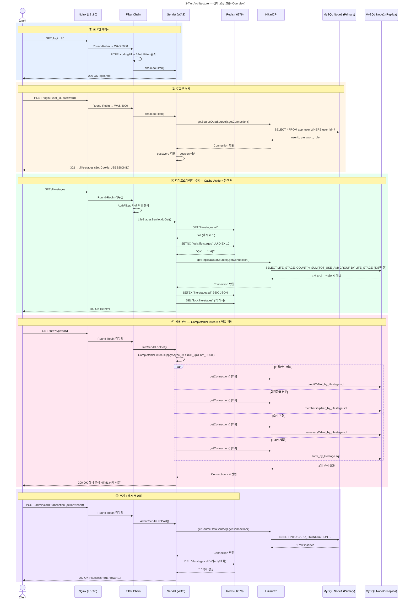

```mermaid
sequenceDiagram
    title 3-Tier Architecture — 전체 요청 흐름 (Overview)

    actor Client as Client
    participant Nginx as Nginx (LB :80)
    participant Filter as Filter Chain
    participant Servlet as Servlet (WAS)
    participant Redis as Redis (:6379)
    participant HikariCP as HikariCP
    participant Source as MySQL Node1 (Primary)
    participant Replica as MySQL Node2 (Replica)

    rect rgb(230, 240, 255)
        Note over Client,Servlet: ① 로그인 페이지
        Client->>Nginx: GET /login :80
        Nginx->>Filter: Round-Robin → WAS:8080
        Filter->>Filter: UTFEncodingFilter / AuthFilter 통과
        Filter->>Servlet: chain.doFilter()
        Servlet-->>Client: 200 OK login.html
    end

    rect rgb(255, 245, 230)
        Note over Client,Source: ② 로그인 처리
        Client->>Nginx: POST /login (user_id, password)
        Nginx->>Filter: Round-Robin → WAS:8090
        Filter->>Servlet: chain.doFilter()
        Servlet->>HikariCP: getSourceDataSource().getConnection()
        HikariCP->>Source: SELECT * FROM app_user WHERE user_id=?
        Source-->>HikariCP: userId, password, role
        HikariCP-->>Servlet: Connection 반환
        Servlet->>Servlet: password 검증 → session 생성
        Servlet-->>Client: 302 → /life-stages (Set-Cookie: JSESSIONID)
    end

    rect rgb(230, 255, 240)
        Note over Client,Replica: ③ 라이프스테이지 목록 — Cache-Aside + 분산 락
        Client->>Nginx: GET /life-stages
        Nginx->>Filter: Round-Robin 라우팅
        Filter->>Filter: AuthFilter: 세션 확인 통과
        Filter->>Servlet: LifeStagesServlet.doGet()
        Servlet->>Redis: GET "life-stages:all"
        Redis-->>Servlet: null (캐시 미스)
        Servlet->>Redis: SETNX "lock:life-stages" UUID EX 10
        Redis-->>Servlet: "OK" → 락 획득
        Servlet->>HikariCP: getReplicaDataSource().getConnection()
        HikariCP->>Replica: SELECT LIFE_STAGE, COUNT(*), SUM(TOT_USE_AM) GROUP BY LIFE_STAGE (538만 행)
        Replica-->>HikariCP: 9개 라이프스테이지 결과
        HikariCP-->>Servlet: Connection 반환
        Servlet->>Redis: SETEX "life-stages:all" 3600 JSON
        Servlet->>Redis: DEL "lock:life-stages" (락 해제)
        Servlet-->>Client: 200 OK list.html
    end

    rect rgb(255, 230, 240)
        Note over Client,Replica: ④ 상세 분석 — CompletableFuture × 4 병렬 쿼리
        Client->>Nginx: GET /info?type=UNI
        Nginx->>Filter: Round-Robin 라우팅
        Filter->>Servlet: InfoServlet.doGet()
        Servlet->>Servlet: CompletableFuture.supplyAsync() × 4 (DB_QUERY_POOL)
        par 신용카드 비중
            Servlet->>HikariCP: getConnection() [T-1]
            HikariCP->>Replica: creditOrNot_by_lifestage.sql
        and 회원등급 분포
            Servlet->>HikariCP: getConnection() [T-2]
            HikariCP->>Replica: membershipTier_by_lifestage.sql
        and 소비 유형
            Servlet->>HikariCP: getConnection() [T-3]
            HikariCP->>Replica: necessaryOrNot_by_lifestage.sql
        and TOP5 업종
            Servlet->>HikariCP: getConnection() [T-4]
            HikariCP->>Replica: top5_by_lifestage.sql
        end
        Replica-->>HikariCP: 4개 분석 결과
        HikariCP-->>Servlet: Connection × 4 반환
        Servlet-->>Client: 200 OK 상세 분석 HTML (4개 섹션)
    end

    rect rgb(240, 230, 255)
        Note over Client,Redis: ⑤ 쓰기 + 캐시 무효화
        Client->>Nginx: POST /admin/card-transaction (action=insert)
        Nginx->>Filter: Round-Robin 라우팅
        Filter->>Servlet: AdminServlet.doPost()
        Servlet->>HikariCP: getSourceDataSource().getConnection()
        HikariCP->>Source: INSERT INTO CARD_TRANSACTION ...
        Source-->>HikariCP: 1 row inserted
        HikariCP-->>Servlet: Connection 반환
        Servlet->>Redis: DEL "life-stages:all" (캐시 무효화)
        Redis-->>Servlet: "1" 삭제 성공
        Servlet-->>Client: 200 OK {"success":true,"rows":1}
    end
```